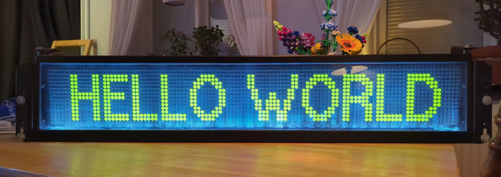
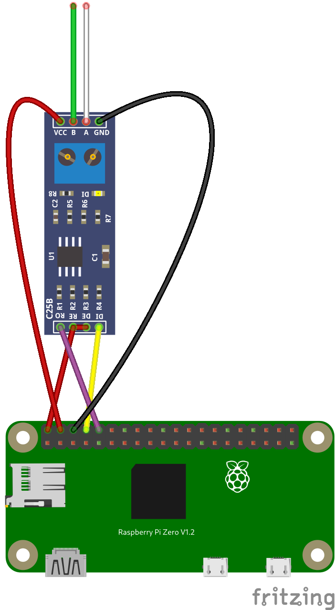

# maskin-flipdot

  

Collection of python libraries, arduinno sketches and documentation about driving mobitec flipdot displays using serial communication.

## Hardware

This library is tested with a MAX485 module for converting the TTL serial signals to RS-485.

  

The pinout from the mobitec flipdot display is:

- Red — +24V
- Black — Ground
- White — RS-485 D+ (A)
- Green — RS-485 D- (B)

See [protocol.md](protocol.md) documentation for more info about the mobitec protocol.

## Installation

To use this project, you'll need to do the following:

1. Clone the repository:

`cd ~`

`git clone https://github.com/Nosen92/maskin-flipdot`

`cd maskin-flipdot`

2. Install the required dependencies:

`pip install -r requirements.txt`

## Usage

The mobitec.py file contains a class that handles all communication using the [mobitec protocol](protocol.md).
The methods for driving the display include:

- `print_text("Example")`Prints a text string.
- `print_image(standard_m)` Prints an image.
- `draw_pixel(x, y)` Flips a single pixel at the coordinates (x, y).
- `display()` Updates the display (applies all commands in buffer).
- `clear_display()` Clears the memory buffers.
- `set_font(13px_wide)` Changes the selected font when writing text.
- `set_cursor(x, y)` Moves the position where the text will be printed.

See example files for further guidance or reference.

## Contributing

If you would like to contribute to this project, please open an issue or submit a pull request on GitHub.

## License

This project is licensed under the MIT License. See the `LICENSE` file for more information.
